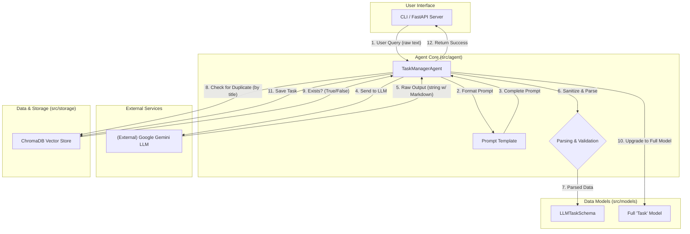

# System Design: AI Task Manager Agent

This document outlines the system architecture and design choices for the AI Task Manager Agent.

## 1. Core Principles

The system is built upon a set of core software and MLOps engineering principles:

-   **Modularity:** Each component of the system (LLM interaction, storage, agent logic) is separated into distinct modules. This makes the system easier to understand, maintain, and upgrade. For example, the `ChromaDB` storage layer could be swapped with another database without changing the core agent logic.
-   **Separation of Concerns:** The agent's "brain" (`src/agent`) is distinct from its "memory" (`src/storage`). Crucially, the data schema expected from the LLM (`LLMTaskSchema`) is separated from the application's internal data model (`Task`). This prevents "prompt leakage" and makes the system more robust against unpredictable LLM behavior.
-   **Scalability:** The architecture is designed to scale. By including a FastAPI server (`src/api`), the agent's logic can be easily exposed as a microservice, ready to serve a web frontend or be integrated into a larger system.
-   **Testability:** Components are designed for testability. The storage layer, for example, is built with factory methods (`for_production`, `for_testing`) and uses dependency injection, allowing for isolated unit tests with an in-memory database.

## 2. System Architecture & Data Flow

The agent operates in a sequential, multi-step process to ensure reliability and data integrity.

### Architecture Diagram (Mermaid)

### Data Flow Explained

1.  **User Input:** The process begins when a user submits a natural language query (e.g., "Call mom on Sunday") via the command-line interface or an API call.

2.  **Prompt Formulation:** The `TaskManagerAgent` receives this query. It enriches it with contextual information (like the current date) and formats it using a predefined `PromptTemplate`. This template instructs the LLM on its role, the desired output format, and provides specific rules for categorization and prioritization.

3.  **LLM Invocation:** The agent sends the completed prompt to the Google Gemini LLM via the `LangChain` framework.

4.  **Output Sanitization:** The LLM returns a raw string, which may include "helpful" text or Markdown formatting (e.g., `\`\`\`json`). The agent's first and most critical post-processing step is to **sanitize** this output, using regular expressions to extract only the pure JSON block.

5.  **Parsing and Schema Validation:** The clean JSON string is then parsed and validated against a strict, safe schema called `LLMTaskSchema`. This schema only contains fields the LLM is expected to generate (`title`, `description`, etc.), preventing validation errors from unexpected fields like `id`.

6.  **Duplicate Check:** Before proceeding, the agent uses the parsed `title` to query the `ChromaDB` vector store via the `task_exists_by_title` method. This method uses an efficient metadata filter to check if a task with the same title already exists, preventing duplicate entries.

7.  **Model Enrichment ("Upgrading"):** If the task is not a duplicate, the agent creates an instance of the full, internal `Task` model. It uses the data from the `LLMTaskSchema` and allows Pydantic to automatically generate the application-controlled fields (`id`, `created_at`, `is_completed`). This "upgrade" step is the core of the separation of concerns pattern.

8.  **Persistence:** The final, complete `Task` object is saved to the `ChromaDB` database.

9.  **Feedback:** The agent reports success or failure back to the user interface.

## 3. Key Technology Choices

-   **LangChain:** Used as the primary framework to orchestrate interactions with the LLM, manage prompts, and parse outputs. Its declarative syntax (LCEL) simplifies the agent's logic.
-   **Pydantic:** Used extensively for data validation. The two-schema approach (`LLMTaskSchema` and `Task`) is a critical design choice for ensuring robustness.
-   **ChromaDB:** Chosen as the vector store for its simplicity and persistence. It serves not only as a task database but also enables powerful future capabilities like semantic search, which is demonstrated in the project's notebooks with FAISS.
-   **Rich & FastAPI:** These libraries are chosen to provide a professional and scalable user interface, demonstrating that the agent is not just a script but the core of a larger potential application.

